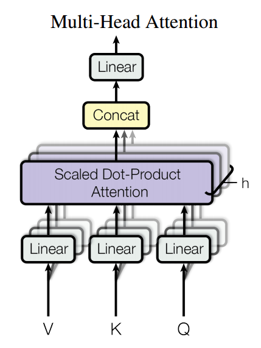
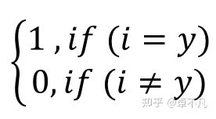
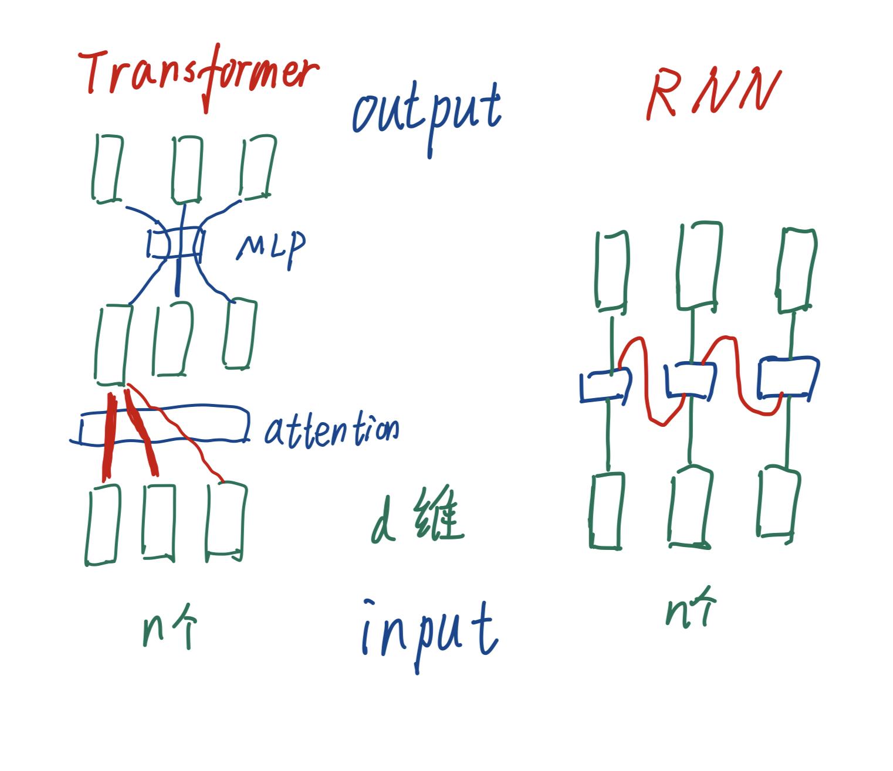
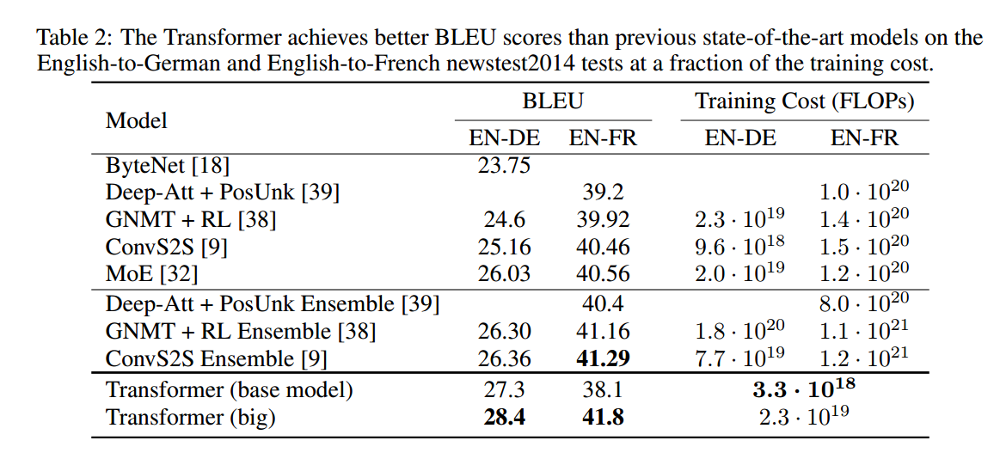
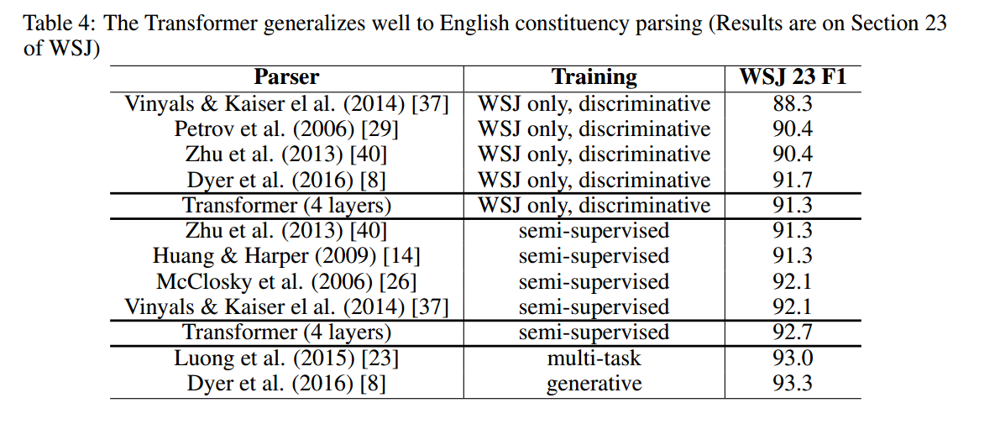
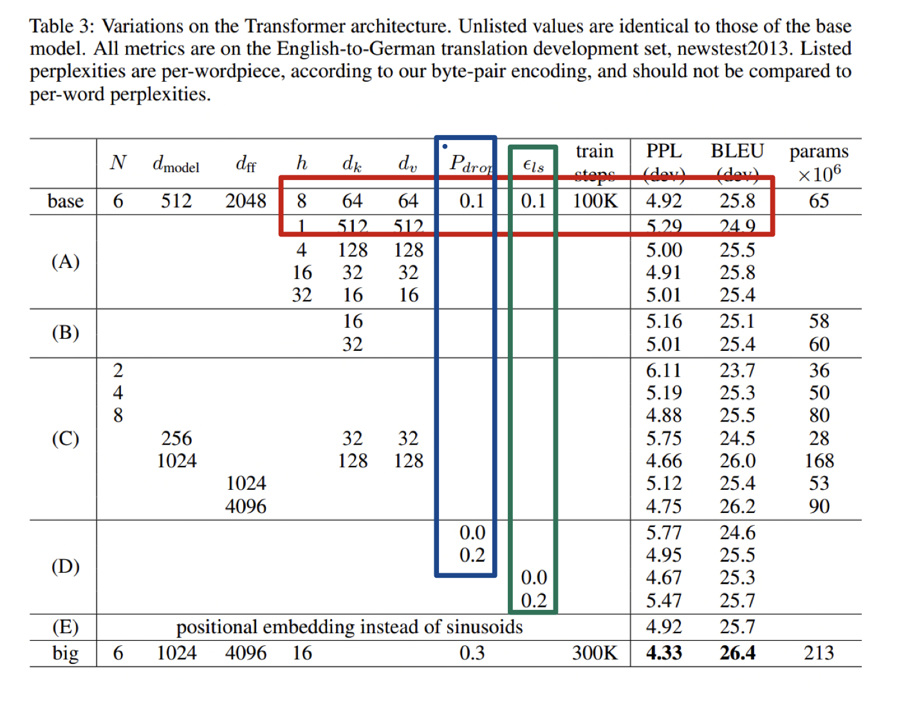

# 2023.07.11阅读笔记

| 项目          | 详情             |
|----------------|-----------------|
| 笔记发布者  | 赵祥宇         |
| 发表年月   | 2017/06/12 |
| 发表情况   | NIPS 2017      |
| 类型         | Conference Article  |
| 论文简述  | Transformer      |
# 论文名

Attention Is All You Need

## 研究方向

Attention mechanisms

## 作者与文献信息

- 第一作者、通讯作者：[Ashish Vaswani](https://arxiv.org/search/cs?searchtype=author&query=Vaswani%2C+A), [Noam Shazeer](https://arxiv.org/search/cs?searchtype=author&query=Shazeer%2C+N), [Niki Parmar](https://arxiv.org/search/cs?searchtype=author&query=Parmar%2C+N), [Jakob Uszkoreit](https://arxiv.org/search/cs?searchtype=author&query=Uszkoreit%2C+J), [Llion Jones](https://arxiv.org/search/cs?searchtype=author&query=Jones%2C+L), [Aidan N. Gomez](https://arxiv.org/search/cs?searchtype=author&query=Gomez%2C+A+N), [Lukasz Kaiser](https://arxiv.org/search/cs?searchtype=author&query=Kaiser%2C+L), [Illia Polosukhin](https://arxiv.org/search/cs?searchtype=author&query=Polosukhin%2C+I)    （Equal contribution）
- 他们所属的研究组：Google Research
- 是否开源代码：
    - 官方
        
        [GitHub - tensorflow/tensor2tensor: Library of deep learning models and datasets designed to make deep learning more accessible and accelerate ML research.](https://github.com/tensorflow/tensor2tensor)
        
    - Pytorch版本
        
        [GitHub - jadore801120/attention-is-all-you-need-pytorch: A PyTorch implementation of the Transformer model in "Attention is All You Need".](https://github.com/jadore801120/attention-is-all-you-need-pytorch)
        

## 论文声称的创新点or贡献

提出了一个新的简单的网络架构，Transformer，仅仅基于注意力机制，完全没有使用递归和卷积神经网络。

> 优点：be superior in quality while being more parallelizable and requiring significantly less time to train.
> 

## 关键知识点与概念

**RNN(2017):**

- LSTM  【Neural computation(1997)】
    
    
    
- GRU (****Empirical Evaluation of Gated Recurrent Neural Networks on Sequence Modeling ) 【CoRR (2014)】****
    
    [Empirical Evaluation of Gated Recurrent Neural Networks on...](https://arxiv.org/abs/1412.3555)
    
- RNN 缺点:   1.难以并行   2.早期的时序信息在后续过程中难以保留
- 改进，不能解决本质问题
- 早期也用到了 Attention  但没有舍弃RNN

**encoder-decoder structure:**

- 编码，将输入序列转化转化成一个固定长度向量。
- 解码，将之前生成的固定向量再转化出输出序列。
- auto-regressive  预测当前时刻的输出依赖于前一时刻的输出，能够建模语言的连续性和上下文依赖性
- 编码器结构：编码器由6个相同层堆叠而成。每个层有两个子层：  multi-head self-attention mechanism,和一个简单的 position-wise fully connected feed-forward network. 每一个子层周围使用residual connection残差连接，然后进行layer normalization层归一化。
    
    
    
    
    
    为了方便残差连接，子层以及嵌入层的输出维度规定为512
    
- 解码器结构： 结构和编码器类似，但加入了一个子层 Masked Multi-HeadAttention 防止时序后面的值出对当前预测的影响，确保了位置i的预测只能取决于位置小于i的已知输出

**BatchNorm和LayerNorm:**

- BN是在batch维归一化，LN是在layer维(即feature维）归一化
- BN一般用于卷积神经网络，适用于图像、语音等数据；LN一般用于RNN，对序列数据效果较好

**Attention:**

- attention函数是将query 和key-value pair映射到output的函数
- query ,key,value都是向量
- output是value的加权和，权重是value对应的key和query的相似度计算来的
- self-attention    q,k,v是一个东西

**The two most commonly used attention functions:**

- additive attention  可处理query和key不等长的情况
- dot-product (multiplicative) attention
- 在实践中，dot-product attention更快，更节省空间，因为它可以使用高度优化的矩阵乘法代码来实现
- 但d[k]较大时，可能在softmax函数处理后被推入具有极小梯度的区域

**Scaled Dot-Product Attention:**

**Multi-Head Attention：**

- learned linear projections多了一些调整的参数
- perform the attention function in parallell                                可以并行地执行注意力函数
- 有助于网络捕捉到更丰富的特征/信息
- 并且由于每个head的维数降低，因此总计算花销与原来的的single-head attention相似。
- 实践证明是有益的

**Position-wise Feed-Forward Networks：**

- MLP
- 512→2048→512

**Embeddings and Softmax：**

- embeddings    利用矩阵乘法升维或降维
    
    [一文读懂Embedding的概念，以及它和深度学习的关系](https://zhuanlan.zhihu.com/p/164502624)
    
- 本文用来 convert the input tokens(词源) and output tokens to vectors of dimension d
- also use the usual learned linear transformation and softmax function to convert the decoder output to predicted next-token probabilities
- 这三个MLP共享权重矩阵以便训练
- 把权重乘以  sqrt{d} 以便和下面的位置编码相加

**Positional Encoding：**

- attention本身没有时序信息，作用是在输入里加入时序信息
- 一个词在嵌入层会表示为d=512的向量，故把代表位置的数字用d=512的向量表示
- embeddings + positional encodings

**Dropout：**

**使神经网络中的某些神经元随机失活，让模型不过度依赖某一神经元，达到增强模型鲁棒性以及控制过拟合的效果。**

[Dropout: A Simple Way to Prevent Neural Networks from Overfitting](https://www.cs.toronto.edu/~hinton/absps/JMLRdropout.pdf)(JMLR,2014)(CCF-A)

**Label smoothing:**

**通过在标签分布中引入小的均匀噪声来平滑标签,减少了真实样本标签的类别在计算损失函数时的权重,起到抑制过拟合的效果，并且提高模型的泛化能力**

****[Delving Deep into Label Smoothing](https://arxiv.org/abs/2011.12562)(TIP,2021)(CCF-A)**

## 主要流程图or算法图

## 对比分析  （Why Self-Attention）

每一层的计算复杂度                   要求的顺序计算数           信息点之间的最长路径

## 实验结果

### 主要实验

1. 实验目的    英语→德语
2. 数据集        WMT 2014 English-German dataset
3. 训练环境   8卡P100 3.5天
4. Adam
5. Regularization方法    Residual Dropout     Label Smoothing

### 消融实验

## 疑惑

## 总结

- Attention的作用 把整个序列的信息聚合起来
- RNN 在并行计算方面存在严重缺陷，但其线性序列依赖性非常适合解决 NLP 任务。但是是这一线性序列依赖特性，导致它很难在并行计算方面取得突破，而 CNN 网络具有高并行计算能力，但结构不能做深，因而无法捕获长距离特征。故最好的特征提取器是 Transformer，在并行计算能力和长距离特征捕获能力等方面都表现优异。
- Attention需要更多的数据，使用更大的模型，模型代价高