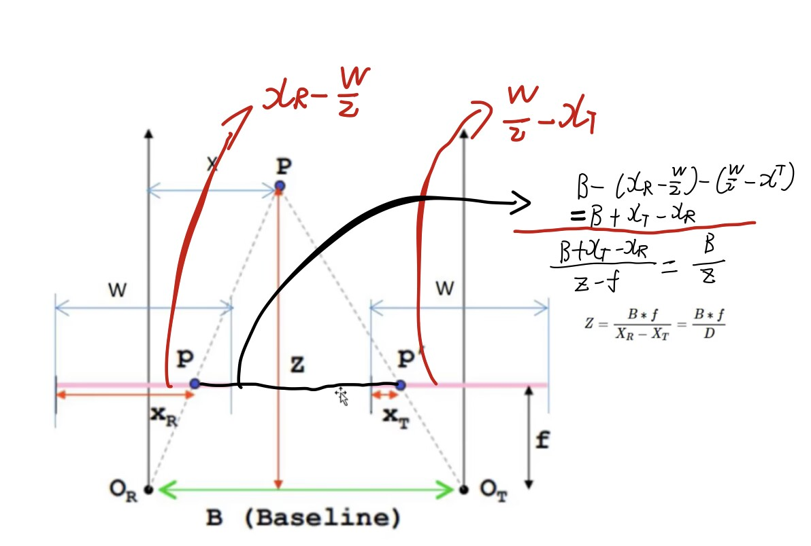

## Binocular camera distance measurement
 
## 原理(基于视差($D=X_{R}-X_{T}$))
### $Z=\frac{B*f}{X_{R}-X_{T}}=\frac{B*f}{D}$

## 要点
1. 行对准  --->  相机要标定，矫正 
2. 立体匹配 
    - 结构光
    - 深度学习网络，如GwcNet
3. 误差分析------摘自([教你提高双目立体视觉系统的精度！---知乎](https://zhuanlan.zhihu.com/p/160946661))
    1. 视差偏差越小，深度偏差越小；换言之，算法的视差精度越高，深度精度越高，深度精度和视差精度成正比。
    2. 基线越大、焦距（像素单位）越长，深度精度越高。深度精度和基线、焦距成正比。
    3. 像素大小越小，同样的物理尺寸焦距有更长的像素尺寸焦距，深度精度就越高。
    4. 测量目标离系统越近，深度精度越高。